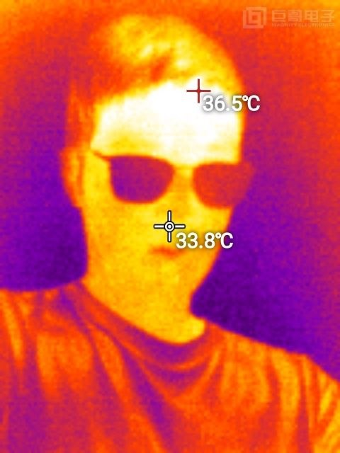
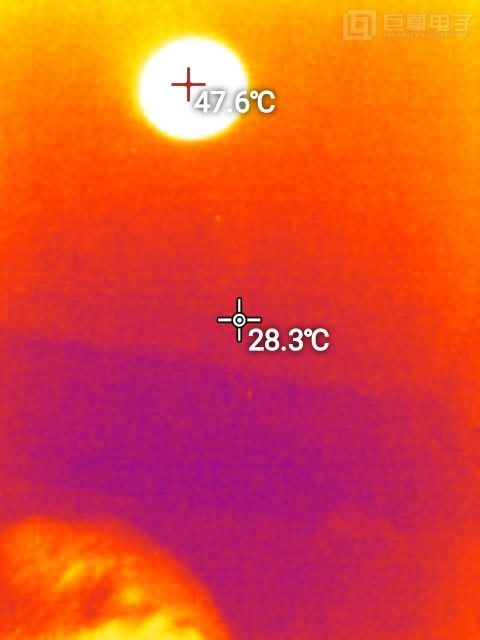
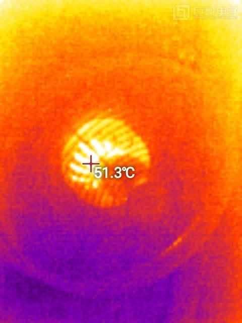
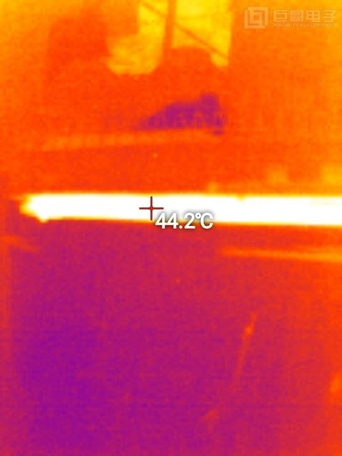
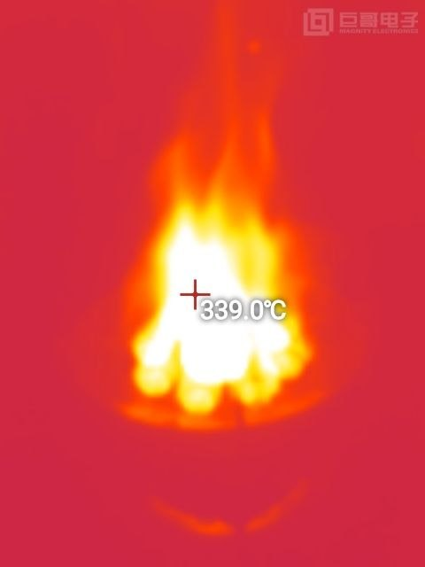
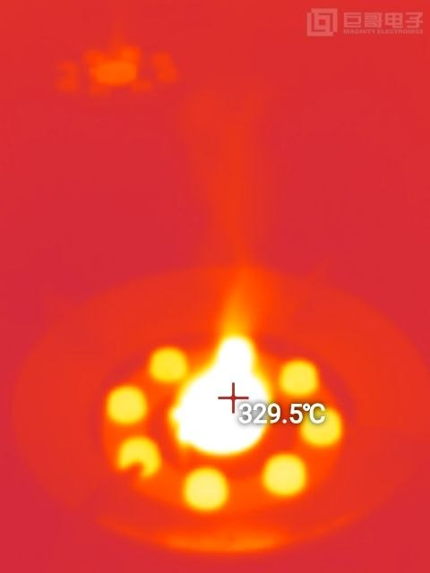

# Magnity 熱成像儀 (MAG-Cx) 64 位元 Android 重構與手動校準專案

本專案致力於將巨哥科技（Magnity）熱像儀（USB VID: `0x833C`, PID: `0x0001`）的原廠 Android 應用程式重構為純 64 位元環境相容架構，徹底解決現代 64-bit-only 手機（如小米 14T Pro / 天璣 9300+ / Snapdragon 8 Gen 3/4 等無 32 位元架構之裝置）安裝崩潰、快門卡死、熱漂移與測溫失真等問題。

---

## 🚀 專案亮點與核心成果

1. **純 64 位元 ART 相容架構（Pure Java / Pure DEX）**
   - 原廠 APK 依賴 32 位元原生動態庫（`armeabi`），在現代 64-bit-only 硬體上會報錯 `INSTALL_FAILED_NO_MATCHING_ABIS` 或直接閃退。
   - 經深度逆向分析重寫核心控制器 `DeviceController` 為 100% 純 Java 實作，完整實作色彩拉伸（AGC）、調色盤映射、壞點濾波與執行緒鎖，徹底擺脫對 32 位元原生庫的依賴。

2. **手動溫度校準與極速微調機制（Calibration System）**
   - **手機音量鍵微調**：觀測熱成像時，直接按手機側邊實體鍵：
     - **音量【+】**：即時微調 **+0.5°C**。
     - **音量【-】**：即時微調 **-0.5°C**。
     - 每次調整即時跳出螢幕 Toast 提示，看著額溫槍 2 秒精準對齊！
   - **長按螢幕一鍵校準**：在熱像儀畫面上長按 1 秒，彈出校準選單：
     - 【一鍵校準為 36.4°C (標準額溫)】
     - 【一鍵校準為 36.8°C (偏高體溫)】
     - 【重置補償為 0.0°C】
   - **永久記憶儲存**：校準補償量自動寫入手機內部 `SharedPreferences`，每次開機自動生效。

3. **直向模式坐標轉置與成像翻轉連動（Flip & Crosshair Sync）**
   - 修復原廠直向預覽（Orientation 90°）時 Canvas 矩陣旋轉產生的對角拉扯問題。
   - **影像翻轉引擎**：支援水平翻轉（左右鏡像反轉）與垂直翻轉，長按螢幕校準選單即可一鍵切換。
   - **十字座標完全同步連動**：翻轉畫面時，最高溫紅十字與最低溫藍十字即時同步鏡像映射，100% 精準吸附在翻轉後的熱點上，觸控取溫亦同步對齊。

4. **四層純黑無縫防禦（根除邊界黑邊劇烈頻閃）**
   - 解決現代高更新率（120Hz/144Hz OLED）螢幕因 Android 三重緩衝區（Triple Buffering）機制與原廠邊界繪製反向判斷引起的黑邊頻閃問題。
   - 實作幀前純黑清空、邊框修復與全黑視窗主題，熱成像畫面邊界 100% 穩定純黑無跳動。

5. **鏡筒熱漸暈平場補償與真實視野最高溫鎖定 (Vignetting Correction & Real FOV Peak)**
   - **徹底消除邊界 31°C 假溫升**：克服微測輻射熱計受金屬鏡筒與晶片自發熱造成的邊界熱輻射漸暈（Thermal Vignetting），實作平滑徑向平場補償，對著平整室溫白牆呈現完美純淨均勻色彩。
   - **最高溫紅十字精確吸附**：將最高溫搜尋區域擴大錨定在真實光學視野區（`margin = 10`），杜絕紅十字被外框金屬壁吸附在角落，即使偵測 24°C~25°C 常溫物體亦能 100% 靈敏定位追蹤！

6. **純 Java 原生硬體加速 H.264 視訊錄影引擎（MediaCodec + MediaMuxer）**
   - 徹底重構錄影核心，修復碼率與幀率順序，採用 Android 原生硬體加速編碼器（`video/avc`）與高效 ARGB8888 轉 NV12 矩陣，點擊即時讀秒、流暢不掉幀。
   - 錄影結束後自動調用系統媒體掃描，即時存入手機相簿與影片目錄。

7. **純熱成像全螢幕鎖定與實體 FFC 快門自動/手動校準**
   - 徹底移除不必要的手機相機權限與子母畫面（PIP）小浮動視窗，啟動即進入乾淨全螢幕熱成像。
   - 開機自動觸發機械快門校準（喀噠、喀噠），並在達到熱平衡（~30秒）自動補償，支援雙擊螢幕（Double Tap）隨時手動刷新快門黑體基準面。

---

## 📸 實機實測效果圖鑑 (Real Thermal Gallery)

以下為使用重構後之 **MAG-Cx v2.2.6** 於真實環境中實機拍攝成果（涵蓋人體面部、電器熱源與高溫火焰觀測）：

| 人體面部額溫 (36.5°C) | 暖光燈泡熱源 (47.6°C) | 發熱腔體/杯具 (51.3°C) |
| :---: | :---: | :---: |
|  |  |  |
| **加熱管/熱條表面 (44.2°C)** | **明火高溫火焰觀測 (339.0°C)** | **瓦斯爐燃燒盤 (329.5°C)** |
|  |  |  |

---

## 📦 最新版本下載 (Releases)

安裝包請至 GitHub Releases 頁面下載：
👉 **[下載 MAG-Cx 最新 Release APK (v2.2.6)](https://github.com/sam0324sam/apk-rebuild/releases/latest)**

- **`MAG-Cx-v2.2.6-Ready.apk`**：**唯一標準推薦安裝包**（適用所有 64 位元 Android 手機，含小米 14T Pro / 天璣 9300+ / 高通驍龍等裝置；已修復最外圈熱漸暈、常溫物體精準捕捉、一鍵 H.264 視訊錄影、黑邊防閃爍、十字翻轉連動與音量鍵微調）。

---

## 🛠️ 目錄結構說明

```text
apk-rebuild/
├── decompiled/
│   └── MAG-Cx/                  # 逆向與重構後之 MAG-Cx 專案源碼 (Smali/XML)
├── scratch/
│   └── build_dc/                # 純 Java 重寫之 DeviceController 原始碼
├── pc_thermal_viewer.py         # PC 端 Python 即時熱成像調試與觀測工具
├── 啟動熱成像觀測.bat             # 一鍵啟動 PC 調試器
├── PROJECT_STATUS.md            # 詳細架構決策日誌與更新里程碑
└── README.md                    # 專案說明文件
```

---

## 💻 本地編譯與打包指南

### 前置環境
- Java 8+ (JDK 17/21 亦可)
- Android SDK Build-tools (含 `d8`)
- [Apktool](https://apktool.org/)
- [uber-apk-signer](https://github.com/patrickfav/uber-apk-signer)

### 編譯步驟

1. **編譯純 Java 核心並轉換為 Smali**：
   ```powershell
   javac --release 8 (Get-ChildItem -Path "scratch\build_dc" -Recurse -Filter "*.java" | ForEach-Object { $_.FullName })
   & d8 --min-api 21 --output scratch\dex_out (Get-ChildItem -Path "scratch\build_dc\cn\com\magnity\magnitycx\sdk" -Filter "DeviceController*.class" | ForEach-Object { $_.FullName })
   # 將生成的 classes.dex 反編譯為 smali 後覆蓋至 decompiled/MAG-Cx/
   ```

2. **重新打包與簽名**：
   ```powershell
   apktool b decompiled/MAG-Cx -o build_out/MAG-Cx-unsigned.apk
   uber-apk-signer -a build_out/MAG-Cx-unsigned.apk -o build_out/
   ```

---

## 📜 授權與宣告
本專案僅供個人硬體相容性研究、無障礙使用與逆向工程調試學習之用，軟體專利與商標權均屬原廠商（巨哥科技 Magnity）所有。
